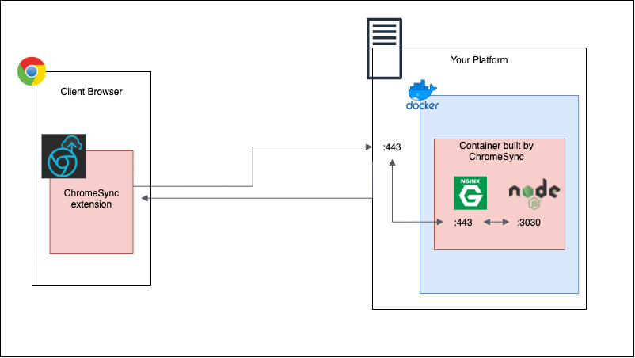

# ChromeSync
a chrome extension that provides open source synchronization of chrome browser data with an endpoint that you own.



## Deployment
This requires that you have a platform that can run the backend service in a docker container.
1. bring in project on platform
```shell
git clone https://github.com/bry-git/ChromeSync
```
2. run the build script, this will build client and backend. The build script takes an argument for the FQDN that will hold the backend, without it the default is `https://localhost`
```shell
./build.sh --hostname https://my-server@domain.com:port
```
3. the client will be built with the required API key baked in. Any other version of the client will not be able to talk to the backend that is built in the build script.
The client will be built in the container and can be retrieved with
```shell
./build.sh --get-client
```
after which the client will be an unpacked chrome extension at `ChromeSync/build`. To install that, go to chrome to `chrome://extensions/` and enable "Developer mode". Select the new option "Load Unpacked" and select the build folder to load the plugin 

## Development

### Client
##### Developing outside of a Container

1. make changes and build the client
```shell
npm run build:dev
```
2. open [chrome://extensions](chrome://extensions) and enable developer mode
3. select *Load Unpacked* and select the build output `ChromeSync/chrome-sync-client/build/`
4. the plugin can be opened from the extensions tray in chrome

### Service
1. make changes, build and start the service
```shell
export API_KEY=<API_KEY> && npm run build && node build/ChromeSyncService.js
```